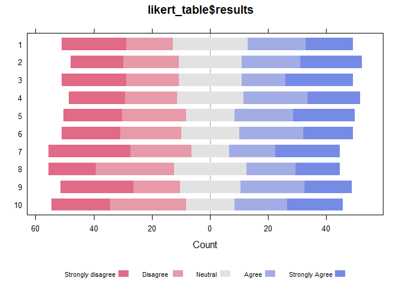

# The shinyLikert package
Gregor de Cillia  
January 26, 2016  

This pakage lets you create shiny widgets for likert scal data with simple syntax. Typacal plots created by this library look like this


```r
library(shinyLikert)
td = createTestData( 100, 10 )
likert_table = shinyLikert:::create_table( td$likert_data )
HH::likert( x = likert_table )
```



The widgets include interactive inputs to alter the plot. Currently supported interactive inputs are

* Height
* Factorlevels for filtering the data

The examples need a shiny server to run, so they are hosted on [my website] Alternatively you can install the package with


```r
devtools::install_github("gregorDeCillia/shinyLikert")
```

and run the examples locally on your computer.


[my website]:  http://gregor-de-cillia.xyz/shiny/shinyLikert/examples/
