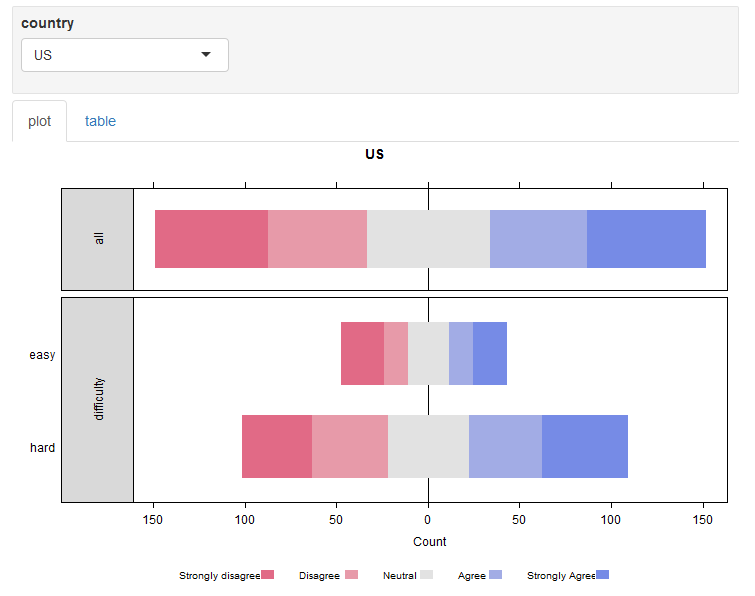

# The shinyLikert package
Gregor de Cillia  

This pakage lets you create shiny widgets for likert scal data with simple syntax. Typacal plots created by this library look like this


```r
library(shinyLikert)
td = createTestData( 100, 10 )
likert_table = likert::likert( td$likert_data )
HH::likert( x = likert_table$results )
```


The widgets include interactive inputs to alter the plot. An interactive output might look like this


```r
fluidPage( renderShinyLikert( 
  testData2,
  dropdown = "country" )
)
```



Note that this is just a screenshot of the widget produced. To see dynamic examples, you can either download the package and run the files in the examples directory yourself or go here

http://gregor-de-cillia.xyz/shiny/shinyLikert/examples/

to get examples which are processed by an online server. The package can be installed from an R terminal with


```r
devtools::install_github("gregorDeCillia/shinyLikert")
```

<p style='text-align:right;'>[$\Uparrow$](./../)</p>
